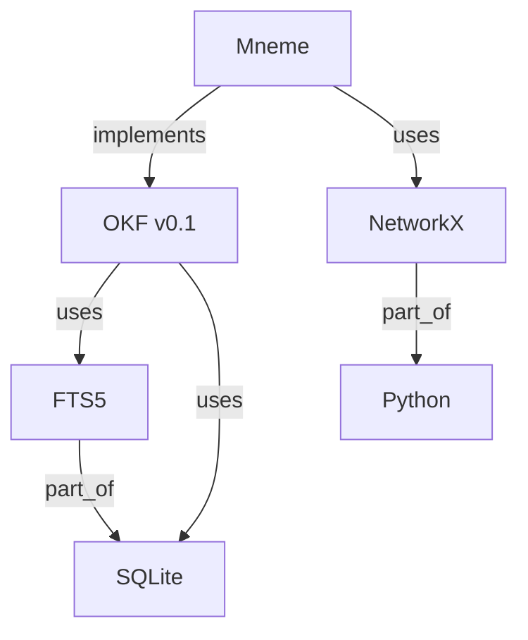

# Mneme v4.0.0 — 图谱增强知识 Wiki 设计方案

> **状态**：Phase 1 MVP 已实施 · 2026-07-20
> **兼容性声明**：v4.0.0 采用向后兼容实现：保留 v3.4.0 的 `dream + search` 用户表面、OKF/Mneme 写作纪律、只读 `mneme dream` 与显式 L2 契约；Graph 只作为从页面、tags 和 Markdown links 派生的可删除索引。
> **作者**：Scott1743 + 小刘鸭
> **前置版本**：v3.4.0（FTS5 + 可选 L2 语义索引）
> **实施范围**：Phase 1——SQLite Graph、`reindex --graph`、graph/fts/hybrid 搜索、Graph 健康统计；Phase 2–4 继续作为后续提案

---

## 0. v4.0.0 实施决议

实际实现选择了兼容优先，而不是直接落地 Draft v2 中全部破坏性设想：

- **OKF Wiki 继续是唯一真相源**：保留 `description`、`tags`、`timestamp` 与 Markdown links；Graph 只从这些字段派生，删掉 `graph.db` 不损失知识。
- **用户表面继续是 `dream + search`**：没有新增顶层 `mneme <source>` 写入动词，写入仍由 host-agent 的 dream 工作流在预览与批准后执行。
- **`mneme dream` 继续只读**：Graph 重建放在内部维护命令 `reindex --graph`；dream 只在报告中读取 Graph 健康统计。
- **检索新增显式覆盖**：`search --mode graph|fts|hybrid`；Graph 存在且 L2 未激活时，普通 search 默认 hybrid。Graph 缺失或没有实体命中时回退 FTS5。
- **Phase 1 保留 v3.4.0 FTS5 schema**：继续索引 `title + description + tags + body`，避免迁移期破坏现有候选与 snippet 契约；body-only schema 推迟到有基准和迁移方案后再决定。
- **Embedding / 社区检测未进入核心路径**：`entity_embeddings` / `communities` 表先保留 schema，Phase 2–3 再做显式可选实现。

`AGENTS.md`、`skills/mneme/SKILL.md` 和 `.research/upstream/OKF-SPEC.md` 仍是实现约束；本文件后续标为“提案”的章节不代表已经交付的行为。

---

## 1. 设计动机

v3.x 的搜索是"关键词匹配 → 候选列表 → agent 读页综合"。当 wiki 增长到数百页时，**跨页关系推理**成为瓶颈——用户问"A 和 B 有什么关联"时，FTS5 只能分别命中 A 和 B，无法直接给出关系链路。

v4.0 引入 **SQLite 知识图谱**作为搜索的前置层：先走图谱召回相关实体和关系，再用 FTS5/L2 做精确匹配，最后由 agent 综合。图谱是 **disposable accelerator**——删掉 `.mneme/graph.db`，wiki 本体和 FTS5 索引仍然完整。

### 核心变化一览

| 维度 | v3.4.0 | v4.0 |
|------|------|------|
| 用户入口 | `dream` / `search`，内部 CLI 为 `init / lint / reindex / dream / search / convert` | **保持不变；内部增加 `reindex --graph` 与 `search --mode graph|fts|hybrid`** |
| 搜索路径 | FTS5(title+description+tags+body) → agent 读页 | **Graph(结构化候选) → FTS5 → agent 综合；无实体命中时 FTS5 fallback** |
| 索引层 | `.mneme/fts.db` + 可选 `.mneme/l2.db` | `.mneme/fts.db` + **`.mneme/graph.db`** + 可选 `.mneme/l2.db` |
| tags / links | frontmatter tags + Markdown links | **继续保留在 Markdown，同时派生为 Graph 的 tagged_by / relates_to 关系** |
| FTS5 索引范围 | title + description + tags + body | **Phase 1 保持不变；body-only 作为后续优化提案** |
| embedding 模型 | 可选，L2 专用 | **Phase 1 仍仅用于显式 L2；实体 embedding 延后** |

---

## 2. 三层功能架构

v4.0 的核心原则是**派生而非迁移**。tags 和 links 同时承担人类可读导航与 Graph 构建输入；Graph 把它们结构化用于遍历，但不能成为唯一存储位置。

```
┌─────────────────────────────────────────────────────────┐
│                   OKF Wiki（唯一真相源）                  │
│                                                         │
│  frontmatter：type + title + description + tags + ...   │
│  Markdown links：可读、可 diff、可从 Graph 缺失时直接使用 │
│  body（正文）→ FTS5 / 显式可选 L2                        │
├─────────────────────────────────────────────────────────┤
│              Graph（可删除派生索引）v4.0 新增             │
│                                                         │
│  page entities：path + title + type + description       │
│  tag entities：tags → tagged_by                          │
│  link relations：Markdown links → relates_to             │
│  health：孤立实体 / 未解析页面 / 连通分量                  │
├─────────────────────────────────────────────────────────┤
│              Content Search（内容检索）                   │
│                                                         │
│  FTS5：title + description + tags + body（Phase 1）      │
│  L2：正文语义向量（显式可选）                             │
│  Hybrid：Graph 候选路径 + FTS5 排序                       │
└─────────────────────────────────────────────────────────┘
```

### 职责分离

| 查询类型 | 走哪层 | 例子 |
|---------|--------|------|
| 实体匹配 | Graph | "OKF 相关的有哪些" |
| 关系遍历 | Graph | "FTS5 和 SQLite 的关系链" |
| Tag 过滤 | Graph | "找 tagged_by [llm-wiki] 的页面" |
| 正文关键词 | FTS5 | "包含 '容错消费' 的页面" |
| 正文语义 | Embedding | "和 '知识持久化' 语义相近的段落" |

### 降级模式

当 `graph.db` 不存在时（用户删除、首次使用、未执行 `reindex --graph`），搜索回退到 v3.4.0 的 FTS5/L0 行为；Phase 1 的 FTS5 始终索引全部既有字段：

| 模式 | graph.db 存在 | FTS5 索引范围 |
|------|-------------|--------------|
| **Hybrid** | ✅ | title + description + tags + body |
| **降级** | ❌ | title + description + tags + body（v3.4.0 行为） |

**关键约束**：Graph 和 FTS5 都是 **disposable**——可删可重建，不拥有事实。OKF Wiki 始终是唯一真相源。

---

## 3. 知识图谱 Schema

### 3.1 表设计

存储在 `.mneme/graph.db`（独立于 `fts.db`，便于单独管理生命周期）。

```sql
-- ============================================================
-- 实体表：存储从 OKF 页面中提取的概念、人物、工具、组织等
-- ============================================================
CREATE TABLE IF NOT EXISTS entities (
    id          INTEGER PRIMARY KEY AUTOINCREMENT,
    name        TEXT    NOT NULL,              -- 实体名称（规范化后）
    entity_type TEXT    NOT NULL DEFAULT 'concept',  -- concept | person | tool | org | topic | source | custom
    page_path   TEXT,                          -- 来源 OKF 页面路径（bundle-relative）
    description TEXT,                          -- 实体描述（可从页面 description 字段继承）
    properties  TEXT,                          -- JSON 扩展属性
    created_at  TEXT    NOT NULL DEFAULT (datetime('now')),
    updated_at  TEXT    NOT NULL DEFAULT (datetime('now')),
    UNIQUE(name, entity_type)
);

-- ============================================================
-- 关系表：存储实体间的有向关系（三元组：subject - predicate - object）
-- ============================================================
CREATE TABLE IF NOT EXISTS relations (
    id          INTEGER PRIMARY KEY AUTOINCREMENT,
    subject_id  INTEGER NOT NULL REFERENCES entities(id) ON DELETE CASCADE,
    predicate   TEXT    NOT NULL,              -- 关系类型：uses | depends_on | is_a | part_of | relates_to | mentions | ...
    object_id   INTEGER NOT NULL REFERENCES entities(id) ON DELETE CASCADE,
    weight      REAL    NOT NULL DEFAULT 1.0,  -- 关系强度 [0.0, 1.0]
    source_page TEXT,                          -- 关系来源页面（用于溯源）
    properties  TEXT,                          -- JSON 扩展属性
    created_at  TEXT    NOT NULL DEFAULT (datetime('now')),
    UNIQUE(subject_id, predicate, object_id)
);

-- ============================================================
-- 实体 embedding 表：复用 L2 的 bge-small-zh-v1.5
-- ============================================================
CREATE TABLE IF NOT EXISTS entity_embeddings (
    entity_id   INTEGER PRIMARY KEY REFERENCES entities(id) ON DELETE CASCADE,
    embedding   BLOB    NOT NULL,              -- float32 向量（384 维 for bge-small-zh-v1.5）
    model       TEXT    NOT NULL DEFAULT 'BAAI/bge-small-zh-v1.5',
    created_at  TEXT    NOT NULL DEFAULT (datetime('now'))
);

-- ============================================================
-- 社区表：Leiden 算法检测的实体聚类
-- ============================================================
CREATE TABLE IF NOT EXISTS communities (
    id              INTEGER PRIMARY KEY AUTOINCREMENT,
    community_id    INTEGER NOT NULL,          -- 社区编号（Leiden 输出）
    entity_id       INTEGER NOT NULL REFERENCES entities(id) ON DELETE CASCADE,
    modularity      REAL,                      -- 模块度得分
    label           TEXT,                      -- 社区标签（由 agent 或 LLM 生成）
    UNIQUE(community_id, entity_id)
);

-- ============================================================
-- 索引
-- ============================================================
CREATE INDEX IF NOT EXISTS idx_entities_name      ON entities(name);
CREATE INDEX IF NOT EXISTS idx_entities_type      ON entities(entity_type);
CREATE INDEX IF NOT EXISTS idx_entities_page      ON entities(page_path);
CREATE INDEX IF NOT EXISTS idx_relations_subject  ON relations(subject_id);
CREATE INDEX IF NOT EXISTS idx_relations_object   ON relations(object_id);
CREATE INDEX IF NOT EXISTS idx_relations_pred     ON relations(predicate);
CREATE INDEX IF NOT EXISTS idx_relations_pred_obj ON relations(predicate, object_id);
CREATE INDEX IF NOT EXISTS idx_communities_entity ON communities(entity_id);
CREATE INDEX IF NOT EXISTS idx_communities_comm   ON communities(community_id);
```

### 3.2 设计决策

| 决策 | 理由 |
|------|------|
| **独立 graph.db**，不与 fts.db 合并 | 职责分离；可单独删除/重建；schema 演进互不干扰 |
| **entity_type 用 TEXT 而非枚举** | OKF 容错消费契约：不因未知 type 拒收；graph 同理 |
| **predicate 用 TEXT** | 关系类型开放，不设全局 taxonomy；wiki 内渐进成长 |
| **UNIQUE(name, entity_type)** | 同名不同类型实体可共存（如 "Python" 可以同时是 tool 和 concept） |
| **embedding 复用 bge-small-zh-v1.5** | 与 L2 共享模型，避免重复下载；384 维够用 |
| **社区表单独存储** | Leiden 结果是快照，随 reindex 更新；不污染实体/关系本体 |

### 3.3 三元组示例

```sql
-- 实体
INSERT INTO entities (name, entity_type, page_path, description)
VALUES ('OKF', 'concept', '/concepts/okf.md', 'Open Knowledge Format v0.1 规范');
INSERT INTO entities (name, entity_type, page_path, description)
VALUES ('SQLite', 'tool', NULL, '嵌入式关系数据库');
INSERT INTO entities (name, entity_type, page_path, description)
VALUES ('FTS5', 'concept', '/concepts/fts5.md', 'SQLite 全文搜索扩展');

-- 关系
INSERT INTO relations (subject_id, predicate, object_id, source_page)
VALUES (1, 'uses', 3, '/concepts/okf.md');        -- OKF uses FTS5
INSERT INTO relations (subject_id, predicate, object_id, source_page)
VALUES (3, 'part_of', 2, '/concepts/fts5.md');    -- FTS5 part_of SQLite
```

---

## 4. CLI 重新设计（Phase 2 提案，未实施）

> v4.0.0 实际保留 `dream + search` 用户表面和六个内部 CLI 子命令；已实施的新增参数是 `reindex --graph` 与 `search --mode graph|fts|hybrid`。以下“三动词入口”保留为未来提案。

### 4.1 三动词入口

```
mneme <verb> [args]
├── mneme   [path]          # 记入：读取源文件 → agent 提取三元组 → 写入 wiki + graph
├── dream   [--rebuild]     # 整理：重建图谱、生成 summary、社区检测、体检报告
└── search  <query> [-k N]  # 检索：图谱遍历 → FTS5 → embedding → 返回候选
```

`init`、`lint`、`reindex` 和 `convert` 在迁移完成前继续保留为内部 CLI 操作，不属于新的用户表面；下表只描述获批后的 v4 迁移方向。

#### `mneme`（记入）

```
mneme [source_path] [--bundle PATH] [--dry-run]
```

**语义**：把新知识"记入"wiki。读取源文件（Markdown/PDF/URL/纯文本），agent 提取实体和关系三元组，写入 OKF 页面 + 更新 graph.db。

**流程**：
1. 读取 source_path 内容
2. Agent 分析文本，提取：
   - 实体（概念、人物、工具、组织…）
   - 关系（三元组）
   - 页面摘要
3. 写入 OKF 页面（`wiki/` 目录）
4. 增量更新 `graph.db`（实体 + 关系 + embedding）
5. 更新 `index.md` + `log.md`
6. 更新 `fts.db`（FTS5 增量同步）

**关键**：`mneme` 命令本身是 **agent 驱动的写入流程**，不再是 v3 的 `init` 子命令。`init` 合并到 `mneme` 的首次运行逻辑中。

#### `dream`（整理）

```
mneme dream [--rebuild] [--dry-run] [--community]
```

**语义**：整理已有的知识图谱和文档。不写入新知识，而是优化现有结构。

**操作**：
- `--rebuild`：从 OKF 页面全量重建 graph.db（相当于 v3.4.0 的 `reindex`）；只写派生索引，不改 OKF 正文、frontmatter、index.md 或 log.md
- `--community`：运行 Leiden 社区检测，更新 communities 表
- `--dry-run`：只输出报告，不写盘
- 默认（无参数）：增量体检并输出报告；任何修复都必须由 host-agent 在明确批准的范围内执行（孤儿页面、悬空链接、tag 漂移、孤立实体）

**输出**：结构化体检报告（JSON），包含：
- OKF 硬规则违规
- 孤儿实体（无关系的实体）
- 悬空链接
- 社区分布
- 图谱统计（实体数、关系数、连通分量数）

#### `search`（检索）

```
mneme search <query> [-k N] [--mode graph|fts|hybrid]
```

**语义**：从 wiki 中检索相关信息。

**默认模式 `hybrid`**（v4.0 新增图谱前置）：
1. 从 query 中提取实体 mention
2. 在 graph.db 中查找匹配实体
3. 图谱遍历（BFS/DFS，depth ≤ 2）收集相关实体和关系
4. 用相关实体的 page_path 定位 OKF 页面
5. FTS5 对这些页面做精确匹配
6. （可选）embedding 重排序
7. 返回候选列表（path + title + snippet + graph_context）

**`--mode graph`**：只走图谱路径（适合关系查询）
**`--mode fts`**：只走 FTS5（v3.4.0 行为，适合关键词查询）

---

## 5. 搜索流水线（Hybrid Search Pipeline）

图谱负责**结构化查询**（实体匹配、关系遍历、tag 过滤），FTS5 负责**非结构化查询**（正文关键词匹配）。两者职责不再重叠。

### 正常模式（graph.db 存在）

```
用户 query
    │
    ▼
┌──────────────────┐
│  实体识别 (NER)    │  从 query 中提取实体 mention
│  "OKF 和 FTS5"   │  → ["OKF", "FTS5"]
└────────┬─────────┘
         │
         ▼
┌──────────────────┐
│  Graph 路径       │  实体匹配 + 关系遍历 + tag 过滤
│  BFS depth ≤ 2   │  收集邻居实体 + 关系 + 社区
│  结构化查询       │  返回 page_path 列表 + graph_context
└────────┬─────────┘
         │
         ▼
┌──────────────────┐
│  FTS5 路径        │  只匹配正文（body only）
│  snippet 提取     │  对 graph 候选页面做精确全文搜索
└────────┬─────────┘
         │
         ▼
┌──────────────────┐
│  (可选) Embedding │  正文语义向量重排序
│  重排序           │  cosine similarity
└────────┬─────────┘
         │
         ▼
┌──────────────────┐
│  得分融合         │  graph + fts + embedding 加权
│  结果输出         │  JSON: candidates + graph_context + scores
└──────────────────┘
```

### 降级模式（graph.db 不存在）

```
用户 query → FTS5(title + description + tags + body) → agent 读页
```

回退到 v3 行为，FTS5 索引范围自动扩大以覆盖元数据。

### 5.1 得分融合公式

```
final_score = α * graph_score + β * fts_score + γ * embedding_score
```

默认权重：`α = 0.4, β = 0.4, γ = 0.2`

- `graph_score`：基于图距离的倒数 + PageRank 权重 + 社区匹配
- `fts_score`：FTS5 BM25 rank 归一化（正常模式只匹配 body）
- `embedding_score`：cosine similarity（仅在 L2 启用时生效）

当 `--mode graph` 时：`α = 1.0, β = 0, γ = 0`
当 `--mode fts` 时：`α = 0, β = 1.0, γ = 0`

### 5.2 FTS5 索引策略

| 模式 | graph.db | FTS5 索引列 | 理由 |
|------|----------|------------|------|
| 正常 | ✅ 存在 | body only | 元数据查询走图谱，FTS5 只负责正文 |
| 降级 | ❌ 缺失 | title + description + tags + body | 图谱不可用，FTS5 兜底全部 |

---

## 6. 技术选型

### 6.1 存储层

| 组件 | 选择 | 理由 |
|------|------|------|
| 图谱存储 | **sqlite3 (stdlib)** | 零依赖；Mneme 已在用；满足中小规模需求 |
| 图遍历 | **NetworkX** | Python 生态标准；BFS/DFS/最短路径/连通分量；可选依赖 |
| 社区检测 | **python-leidenalg** | Leiden 算法；配合 NetworkX 使用；可选依赖 |
| Embedding | **fastembed + bge-small-zh-v1.5** | 复用 L2 已选模型；384 维；中文优化 |
| 向量相似度 | **sqlite-vec 或纯 Python cosine** | sqlite-vec 更快；纯 Python 作为 fallback |

### 6.2 为什么不选其他方案

| 方案 | 不选的理由 |
|------|-----------|
| **sqlite-graphrag** | Rust 二进制；CLI-first 不适合嵌入 Python skill；依赖 claude/codex CLI 做 embedding；对 Mneme 来说过重 |
| **sqlite-muninn** | 功能强大但需要编译 C 扩展；增加了安装复杂度；Mneme 保持零编译依赖的原则 |
| **LightRAG 全套** | 太重——自带 LLM 调用、chunking、多存储后端；Mneme 只需要图谱存储和遍历，不需要 RAG 框架 |
| **@fluxgraph/knowledge** | Node.js 生态；Mneme 是 Python 项目；架构不匹配 |
| **Neo4j / 专业图数据库** | 违反"仅本地文件系统、无服务端"硬约束 |

### 6.3 依赖分层

```
L0（零依赖，stdlib only）
├── sqlite3          ← stdlib
├── json / 项目内最小 YAML 解析器      ← stdlib
└── re / pathlib     ← stdlib

L1（核心可选依赖，pip install mneme）
├── networkx         ← 图遍历
└── fastembed        ← embedding 生成（复用 L2）

L2（高级可选依赖，pip install mneme[graph]）
├── python-leidenalg ← 社区检测
└── sqlite-vec       ← 向量索引加速

L3（可视化可选依赖，pip install mneme[graph-viz]）
└── matplotlib       ← 图谱可视化
```

**原则**：L0 永远能跑（纯 sqlite3 SQL 遍历）；L1 提供图遍历 + embedding；L2 提供社区检测 + 向量加速；L3 仅提供可视化。用户按需安装。

**v4.0.0 实际实现**：Phase 1 只使用 L0（sqlite3 + 项目内解析器 + Python 标准库）；NetworkX、fastembed、Leiden、sqlite-vec 与 matplotlib 均未进入默认或 Graph 重建路径。

---

## 7. Agent 工作流（Phase 2 提案，未实施）

### 7.1 `mneme`（记入）工作流

```
用户输入源文件
    │
    ▼
Agent 读取文件内容
    │
    ▼
Agent 提取结构化信息（prompt-driven）：
  ├── 实体列表：[{name, type, description}]
  ├── 关系列表：[{subject, predicate, object}]
  └── 摘要：one-liner description
    │
    ▼
Agent 写入 OKF 页面（wiki/ 目录）
  ├── frontmatter: type, title（拟议 v4 最小字段；type 是 OKF 必填，title 是推荐字段）
  ├── 正文：整理后的内容
  └── 不再写 tags/links——这是拟议 v4 的迁移方向，与 v3.4.0 当前写作纪律存在冲突
    │
    ▼
CLI 增量更新 graph.db
  ├── INSERT OR IGNORE entities（name, type, description, page_path）
  ├── INSERT OR IGNORE relations（含 tagged_by 关系，替代 tags）
  ├── 生成 embedding → INSERT entity_embeddings
  └── 更新 FTS5 索引（body only，正常模式）
    │
    ▼
CLI 更新 index.md + log.md
```

**Agent 的 prompt 设计**（在 SKILL.md 中定义）：

```markdown
## 实体提取规则

从输入文本中提取以下类型的实体：
- **concept**：抽象概念、理论、方法论
- **tool**：软件、库、框架、CLI 工具
- **person**：人名（如果有）
- **org**：组织、公司、团队
- **topic**：主题领域
- **source**：原始资料、论文、文档
- **tag**：主题标签（v4 中 tags 作为实体进入图谱）

每个实体必须包含：name（规范化名称）、type（上述类型之一）、description（一句话描述）。

## 关系提取规则

提取实体间的有向关系，使用以下 predicate：
- **uses**：A 使用 B
- **depends_on**：A 依赖 B
- **is_a**：A 是 B 的一种
- **part_of**：A 是 B 的一部分
- **relates_to**：A 与 B 相关（泛化）
- **mentions**：A 提到了 B
- **extends**：A 扩展了 B
- **implements**：A 实现了 B
- **inspired_by**：A 受 B 启发
- **tagged_by**：页面 tagged_by 某个 tag 实体（替代 frontmatter tags）

如果无法确定具体关系类型，使用 `relates_to`。

## OKF 页面写入规则

拟议 v4 页面 frontmatter 最小化为 type + title：
```yaml
---
type: Concept          # OKF 协议必填
title: 某某概念         # 推荐字段
---
```

不再写 tags、description、links——这是拟议 v4 的迁移方向，与 v3.4.0 当前 Mneme 写作纪律存在冲突，必须在实现前单独评审。
正文内容写入 Markdown body，由 FTS5 索引。
```

### 7.2 `dream`（整理）工作流

```
Agent 调用 mneme dream [--rebuild]
    │
    ▼
CLI 遍历 wiki/ 所有 .md 文件
    │
    ├─→ 解析 frontmatter → 提取 type, title, description
    ├─→ Agent 提取页面中的实体和关系
    └─→ 与 graph.db 中已有实体对比
    │
    ▼
增量更新：
  ├── 新增实体（页面中提到但 graph 中没有的）
  ├── 删除孤立实体（graph 中有但页面中已不存在的）
  ├── 更新关系（从页面正文中提取新关系）
  └── 更新 embedding（实体描述变化时重新生成）
    │
    ▼
社区检测（--community）：
  ├── 从 graph.db 加载 NetworkX 有向图
  ├── 运行 Leiden 算法
  └── 写入 communities 表
    │
    ▼
输出体检报告
```

### 7.3 `search`（检索）工作流

```
用户 query
    │
    ▼
Agent 调用 mneme search <query> --mode hybrid
    │
    ▼
CLI 执行：
  1. 实体识别（简单规则：query 中的名词与 entities.name 匹配）
  2. 图谱 BFS（depth=2）收集相关实体
  3. 从相关实体的 page_path 收集候选页面
  4. FTS5 对候选页面做精确匹配
  5. 计算融合得分
  6. 返回 JSON: {candidates, graph_context, scores}
    │
    ▼
Agent 读取 top-k 候选页面全文
    │
    ▼
Agent 综合答案（引用 bundle 内路径）
```

---

## 8. 可视化（Phase 3 提案，未实施）

### 8.1 Mermaid 图谱导出

```bash
mneme dream --export-mermaid > graph.md
```

输出 Mermaid 格式的有向图，可嵌入 GitHub/GitLab README：



### 8.2 NetworkX 可视化（可选）

当安装了 matplotlib 时，`mneme dream --visualize` 可生成 PNG/SVG 图谱图。

---

## 9. 与 v3.x 的兼容性

### 9.1 迁移路径

```
v3.4.0 bundle（有 tags + links 的 wiki）
    │
    ▼
mneme reindex --graph
    │
    ├── 新建 graph.db（原子替换）：
    │   ├── frontmatter tags → tag entities + tagged_by relations
    │   ├── Markdown links → page relations（relates_to）
    │   └── description / title → page entity properties
    ├── 刷新现有 FTS5（保留 title + description + tags + body schema）
    ├── 保留 l2.db（如果存在）
    └── 不修改 config.toml、OKF frontmatter、index.md 或 log.md
    │
    ▼
v4.0 bundle（原有 OKF/Mneme 写作纪律保持不变）
```

### 9.2 未来配置扩展提案（未实施）

```toml
# ~/.config/mneme/config.toml

[core]
bundle_path = "/path/to/wiki"

[retrieval]
active_mode = "hybrid"          # hybrid | graph | fts
graph_weight = 0.4              # α
fts_weight = 0.4                # β
embedding_weight = 0.2          # γ
graph_depth = 2                 # BFS 最大深度
embedding_model = "BAAI/bge-small-zh-v1.5"

[graph]
community_detection = true       # 是否在 dream 时运行社区检测
export_mermaid = true            # 是否在 dream 时导出 Mermaid
```

### 9.3 v4.0 实际命令兼容

| v3.4.0 命令 | v4.0 行为 |
|-----------|-----------|
| `mneme init <path>` | 保留，不改退出码与脚手架契约 |
| `mneme lint` | 保留为独立 lint，不改退出码契约 |
| `mneme reindex` | 保留，继续按持久化 FTS5/L2 模式重建 |
| `mneme reindex --graph` | **新增**：重建 graph.db 并刷新 FTS5，不修改 Markdown |
| `mneme reindex --l2` | 保留显式启用与持久化 L2 的契约 |
| `mneme search <q>` | Graph 存在且 L2 未激活时默认 hybrid；否则保持原模式 |
| `mneme search <q> --mode graph|fts|hybrid` | **新增**：单次查询覆盖，不持久化模式 |
| `mneme dream` | 保持只读审计；Graph 存在时附加健康统计 |
| `mneme convert` | 保留（不改） |

---

## 10. 实现分期

### Phase 1：图谱基础（MVP，v4.0.0 已实施）

- [x] graph.db schema 创建（`graphlib.py`）
- [x] 从 OKF 页面自动提取实体/关系（规则：tags → tagged_by，links → relates_to）
- [x] 原子 `mneme reindex --graph`：全量重建 graph.db + 刷新 FTS5
- [x] `mneme search --mode graph` 基础图谱搜索（双向 BFS，depth ≤ 2）
- [x] `mneme search --mode hybrid` Graph/FTS5 融合与无实体命中 fallback
- [x] `mneme dream --json` 只读 Graph 健康统计
- [ ] FTS5 body-only schema（兼容性评审后再决定；v4.0.0 保留全字段 schema）

### Phase 2：Agent 驱动的智能提取

- [ ] Agent prompt 设计（实体/关系提取规则）
- [ ] `mneme <source>` 记入流程（agent 提取 + 写入 wiki + 更新 graph）
- [ ] embedding 生成（复用 fastembed + bge-small-zh-v1.5）
- [ ] embedding 重排序

### Phase 3：社区检测 + 可视化

- [ ] Leiden 社区检测（python-leidenalg）
- [ ] Mermaid 图谱导出
- [ ] NetworkX 可视化（可选）
- [ ] 社区标签生成（agent 辅助）

### Phase 4：优化 + 打磨

- [ ] 增量更新优化（diff-based，不全量重建）
- [ ] 图谱统计仪表盘
- [ ] 性能测试（1000+ 实体场景）
- [ ] 文档 + 迁移指南

---

## 11. 设计决策记录

### 已解决：Markdown 权威性与 Graph 去重（2026-07-20）

**问题**：OKF frontmatter 的 tags 和 Markdown links 与 Graph 三元组存在语义重叠，但全部迁入 Graph 会破坏 git-native、自描述和 disposable accelerator 契约。

**v4.0.0 结论**：
- tags / links 继续留在 Markdown，Graph 仅派生 `tagged_by` / `relates_to` 关系；
- FTS5 Phase 1 继续索引 `title + description + tags + body`，兼容既有候选契约；
- OKF/Mneme frontmatter 写作纪律不变；Graph 删除后，FTS5/L0 与 agent 直接读页仍完整可用；
- 更深层 typed relations、实体 embedding 与 community detection 推迟到后续显式可选阶段。

**降级策略**：graph.db 缺失或 query 无实体命中时，hybrid 自动回退 FTS5；激活的 L2 仍不静默回退。

### 开放问题

1. **实体去重**：同一概念在不同页面中可能有不同名称（如 "SQLite" vs "sqlite" vs "sqlite3"）。是否需要实体消歧？
   - **倾向**：Phase 1 用规范化（lowercase + strip），Phase 2 引入 embedding 相似度消歧。

2. **关系自动推断**：除了从 links 和 tags 推断关系，是否需要 agent 做更深层的关系提取？
   - **倾向**：Phase 2 用 agent prompt 做深度提取，Phase 1 只用规则。

3. **图谱大小限制**：sqlite-muninn 和 NetworkX 在多大规模下性能可接受？
   - **倾向**：先跑 benchmark；目标 1000 实体 / 5000 关系内亚秒级响应。

4. **夜巡整合**：v4.0.0 的 `dream --json` 已读取 Graph 健康统计；后续是否把无歧义的 graph.db 重建加入受限自动修复白名单？
   - **倾向**：可以，因为只改 disposable accelerator；仍需遵守用户选择的夜巡模式。

5. **旧 wiki 迁移**：无需修改已有 Markdown。首次 `mneme reindex --graph` 直接从现有 tags/links 派生 Graph；删除 graph.db 即完成回退。

---

## 附录 A：技术方案对比

| 方案 | 语言 | 图谱存储 | 图遍历 | Embedding | 安装复杂度 | 适合 Mneme？ |
|------|------|----------|--------|-----------|-----------|-------------|
| **sqlite3 + NetworkX** | Python | sqlite3 | NetworkX | fastembed | 低（pip） | ✅ 最佳 |
| sqlite-graphrag | Rust | SQLite | 内置 | fastembed/LLM | 高（cargo） | ❌ 过重 |
| sqlite-muninn | C | SQLite | 内置 | GGUF | 中（编译） | ⚠️ 功能强但编译门槛 |
| LightRAG | Python | SQLite/Neo4j | 内置 | 外部 LLM | 高（全框架） | ❌ 太重 |
| @fluxgraph/knowledge | TS | SQLite | 内置 | - | 低（npm） | ❌ 语言不匹配 |

## 附录 B：SQL 查询示例

```sql
-- 查找某实体的所有关系（1-hop）
SELECT e2.name, e2.entity_type, r.predicate, r.weight
FROM relations r
JOIN entities e1 ON r.subject_id = e1.id
JOIN entities e2 ON r.object_id = e2.id
WHERE e1.name = 'OKF'
UNION ALL
SELECT e2.name, e2.entity_type, r.predicate, r.weight
FROM relations r
JOIN entities e1 ON r.subject_id = e1.id
JOIN entities e2 ON r.object_id = e2.id
WHERE e2.name = 'OKF';

-- 查找两个实体之间的最短路径（2-hop）
WITH RECURSIVE path(node_id, depth, path_nodes) AS (
    SELECT id, 0, name FROM entities WHERE name = 'Mneme'
    UNION ALL
    SELECT
        CASE WHEN r.subject_id = p.node_id THEN r.object_id ELSE r.subject_id END,
        p.depth + 1,
        p.path_nodes || ' → ' || e.name
    FROM path p
    JOIN relations r ON (r.subject_id = p.node_id OR r.object_id = p.node_id)
    JOIN entities e ON e.id = CASE WHEN r.subject_id = p.node_id THEN r.object_id ELSE r.subject_id END
    WHERE p.depth < 2 AND e.name != 'Mneme'
)
SELECT path_nodes FROM path WHERE node_id = (SELECT id FROM entities WHERE name = 'FTS5')
LIMIT 5;

-- 统计图谱概况
SELECT
    (SELECT COUNT(*) FROM entities) AS entity_count,
    (SELECT COUNT(*) FROM relations) AS relation_count,
    (SELECT COUNT(DISTINCT community_id) FROM communities) AS community_count;

-- 按类型统计实体
SELECT entity_type, COUNT(*) AS cnt
FROM entities
GROUP BY entity_type
ORDER BY cnt DESC;

-- 找出孤立实体（无任何关系）
SELECT e.name, e.entity_type
FROM entities e
LEFT JOIN relations r1 ON r1.subject_id = e.id
LEFT JOIN relations r2 ON r2.object_id = e.id
WHERE r1.id IS NULL AND r2.id IS NULL;

-- 加权入度近似分数（不是严格的 PageRank）
SELECT
    e.name,
    SUM(r.weight) / (SELECT COUNT(*) FROM relations) AS weighted_indegree_approx
FROM entities e
JOIN relations r ON r.object_id = e.id
GROUP BY e.id
ORDER BY weighted_indegree_approx DESC
LIMIT 10;
```
